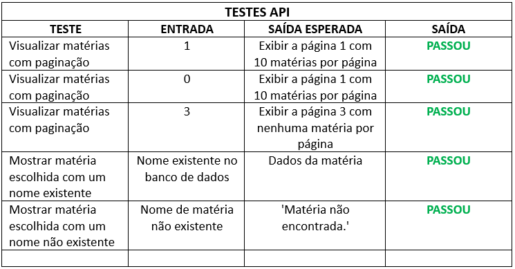

    <h1 id="titulo" align="center"> Documentação API - Perfil Backend Challenge</h1>
	<h2 id="titulo" align="center"> Desafio da Maximize - Evelyn Suzarte Fernandes</h1>
	

	

    <h1>Sumário</h1>
	<ul>
        <li><a href="#objetivos"> <b>Objetivos</b></li>
        <li><a href="#pre-requisitos"> <b>Pré-requisitos</b></li>
		<li><a href="#requsitos"> <b>Requisitos</b></li>
        <li><a href="#como-rodar-o-codigo"> <b>Como rodar o código</b></li>
		<li><a href="#implementação"> <b>Implementação</b> </a> </li>
        <li><a href="#testes-executados"> <b>Testes executados</b> </a> </li>
		<li><a href="#arquiteturas-testadas"> <b>Arquiteturas testadas ou abandonadas</b> </a> </li>
        <li><a href="#ideias-futuras"> <b>Ideias futuras</b> </a> </li>
        <li><a href="#conclusao"> <b>Conclusão</b> </a> </li>
	</ul>	

	<h1>Objetivos</h1>
	
Entrega de um feed de notícias para uma aplicação com o uso de API, com criação opcional do frontend.

	<h1>Pré-requisitos</h1>
	<h4>Antes de começar, você vai precisar ter instalado:</h4>
	<ul>        
		<li><a href="https://code.visualstudio.com/download">Visual Studio Code</a></li>
        <li><a href="https://laravel.com/docs/10.x/installation">Laravel</a></li>
        <li><a href="https://www.apachefriends.org/pt_br/index.html">XAMPP (para instalar o PHP junto) ou outro programas para servidor</a></li>
        <li><a href="https://getcomposer.org/download/">Composer</a></li>
	</ul>

    <h1>Requisitos</h1>
	<ul>
		<li>Criação da API :heavy_check_mark:</li>
		<li>Código entregue através de um repositório público :heavy_check_mark:</li>
		<li>A API deve conter dois endpoints: o primeiro deve entregar uma lista de matérias com paginação e o segundo deve entregar a matéria completa :heavy_check_mark:</li>
		<li>A matéria deve conter os campos: 'título', 'descricao', 'imagem', 'texto_completo', 'data_de_publicacao' :heavy_check_mark:</li>
		<li>API desenvolvida com a linguaguem PHP e framework Laravel ou Lumen :heavy_check_mark:</li>

	<h1>Como rodar o código</h1>
    

        <h3>Antes de rodar o código você precisa:</h3>
        
1. Criar o banco de dados

        
Execute o comando para criar a tabela no banco de dados:

          <b>php artisan migrate</b>
        
2. Criar as seeders para preencher o banco de dados com dados aleatórios

          <b>php artisan make:seeder DatabaseSeeder</b>
        
3. Ativar o Apache e MySQL no XAMPP

          <b>php artisan make:seeder DatabaseSeeder</b>
    

    

        <h3>Testar através do navegador:</h3>
        
Clone o projeto para o seu computador:

        <b>git clone</b>
          
Abra o terminal dentro da pasta do projeto e digite o comando para rodar o servidor:

        <b>php artisan serve</b>
          
Para verificar o primeiro endpoint, clique no link gerado no terminal e adicione no link ou digite no navegador:

        <b>http://127.0.0.1:8000/materias/1</b>
        
O número 1 pode ser alterado para qualquer número desejado para alterar a página na paginação.

          
Para verificar o segundo endpoint, clique no link gerado no terminal e adicione no link ou digite no navegador:

        <b>http://127.0.0.1:8000/mostrarMateria/{titulo}</b>
        
Na variável {titulo}, digite o nome da matéria a ser vista.

    

    

        <h3>Testar através do Postman ou Insomnia:</h3>
        
Clone o projeto para o seu computador:

        <b>git clone</b>
          
Abra o terminal dentro da pasta do projeto e digite o comando para rodar o servidor:

        <b>php artisan serve</b> 
          
Para verificar o primeiro endpoint, clique no link gerado no terminal e adicione no link ou digite no navegador:

        <b>http://127.0.0.1:8000/materias/{página}</b>
        
Sendo a variável {pagina} um número, podendo ser alterado para qualquer número desejado para a paginação. Copie o link e cole no Postman(ou Insomnia), selecionando a opção "GET" e depois "SEND"

          
Para verificar o segundo endpoint, clique no link gerado no terminal e adicione no link ou digite no navegador:

        <b>http://127.0.0.1:8000/mostrarMateria/{titulo}</b>
        
Na variável {titulo}, digite o nome da matéria a ser vista. Copie o link e cole no Postman(ou Insomnia), selecionando a opção "GET" e depois "SEND"

    

    

 

	<h1>Implementação</h1>
    <h3>Organização dos arquivos:</h3>
	
Foi criado um projeto Laravel, onde no arquivo do Controller no endereço 'app/http/controllers/MateriaController.php' é controlada as funções de mostrar as matérias e de mostrar a matéria específica.
 
    
No endpoint "materias", é retornado os dados do banco a partir das colunas que devem ser exibidas ('titulo', 'descricao', 'imagem', 'data_de_publicacao'), utlizando da função 'select'. No método também tem o parâmetro "string $pagina", a página é capturada através do link e ao digitar um número, o usuário será direcionado para a página de matérias desejada, essa opção é configurada na função "paginate".

    
No segundo endpoint "mostrar_materia", foi retornada toda a matéria onde o título é aquele em que o usuário busca, buscando pela função "where". Para ajudar na busca foi usado o método "firstOsFail" que é usado para recuperar o primeiro resultado de uma consulta, e caso não for encontrado nenhum resultado, ele retorna uma exceção, o que facilita o tratamento de erro. Nesse caso, quando não é encontrado o texto digitado, é retornada uma mensagem de erro.  

    
Para criação do objeto Materia, foi criado o arquivo 'app/Models/Materia.php' que serve como uma modelagem do tipo de dados que será usado no projeto, com isso, foi colocado os parametro referentes a matéria.

    
Para determinação dos links para acesso aos endpoints, foi configurado no arquivo de rotas no endereço 'routes/web.php' onde é criado os links necessários. Os dois links recebem os parâmetros através do link, '/materias/{pagina}' para o endpoint um e'/mostrarMateria/{titulo}'para o endponint dois.

    
No arquivo '.env', foi feita a configuração de conexão com o banco de dados.

    <h3>Banco de dados:</h3>
    
Para criação do banco de dados, foi utilizado o Migrations. No arquivo 'database/migrations/2024_03_02_042046_materias.php' foi criada a modelagem da tabela "materias", é colocado os atributos para posteriormente ser conectado ao PHP MyAdmin, que foi o local onde o banco ficou armazenado. Foi decidido usar o Migrations pois é uma forma de modelar o banco de dados de forma prática, fazendo as configurações através dos arquivos com comandos simples, além de ser uma ferramenta usada diretamente do Laravel.

    
Para a facilitação do preenchimento do banco de dados, foi utilizado o seeders, uma ferramenta do laravel para geração de dados aleatórios, onde foi feita a configuração no arquivo 'database/seeders/DatabaseSeeder.php', onde foram gerados dados aleatórios de acordo com tamanhos especificados e tipo para cada variável.

  

	<h1>Testes executados</h1>
	
Testes principais feito com os endpoints.

    

	<h6 align="center">Figura 1 - Testes</h6>

	<h1>Arquiteturas testadas ou abandonadas</h1>
	
De início foi pensado em fazer o banco de dados através de um arquivo SQL, com a query de criação do banco, tabela e colunas, mas essa ideia foi abandonada já que utilizar o Migrates foi uma opção mais tranquila e simples de fazer, caso tivesse alguma correção para fazer também seria rápido, além de ser melhor de observar erros no código.

    
Outra mudança feita também foi de usar dados fictícios aleatórios ao invés de utilizar dados de exemplo mais reais mas ainda fictícios, seria mais trabalhoso pois teria que ser feito de um a um e exigiria mais tempo de preparação das informações, com a utilização da funcionalidade Seeders, foi possível gerar de forma aleatória, em uma quantidade desejada e de forma mais rápida. 

	<h1>Ideias futuras</h1>
	
Caso houvesse mais tempo para o projeto, eu gostaria de poder fazer o frontend, para tornar o sistema mais interativo, tendo uma interface com o usuário, além também do uso de imagens no front, os nomes de imagens usadas nesse projeto foram fictícias, não existem. Também gostaria de expandir mais alguns detalhes sobre a matéria, poderia ter o nome do autor, site de referência, informações de localidade, tipo, entre outros. Além disso, o projeto poderia ter mais endpoints, como adicionar ou remover uma matéria. Uma boa opção seria também o teste da API via container Docker, seria mais prático e mais fácil de testar. 

	<h1>Conclusão</h1>
	
A API funciona como esperado, cumprindo todos os requisitos, o projeto apenas não possui o frontend, colocado como requisito opcional, além do teste via container docker. 

